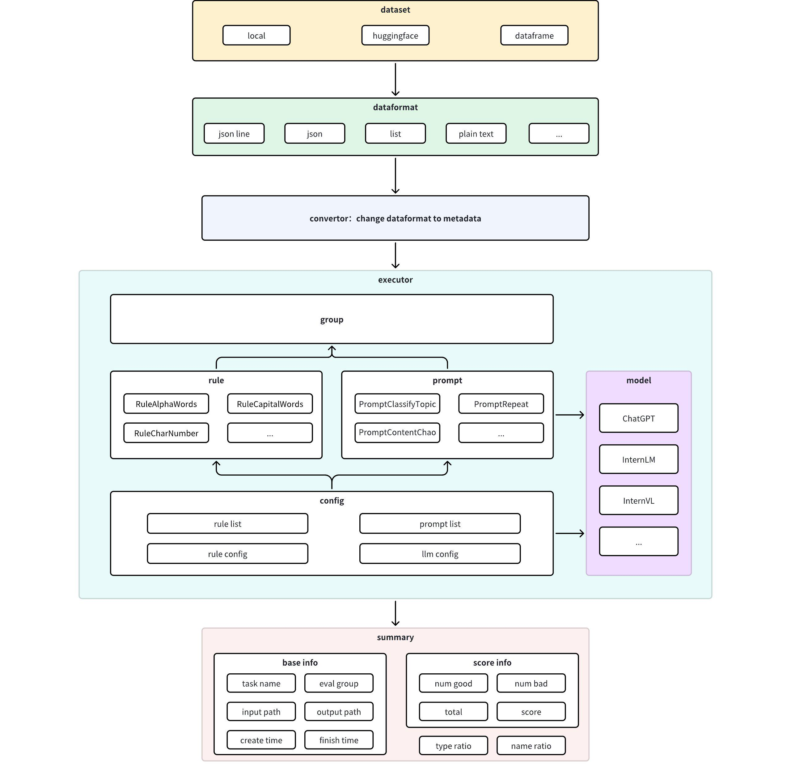

<div align="center" xmlns="http://www.w3.org/1999/html">
<!-- logo -->
<p align="center">
  
</p>

<!-- icon -->
[](https://github.com/pre-commit/pre-commit)


</div>

# Changelog

- 2024/xx/xx: Project Initialization

# 一、介绍

Dingo是一款数据质量评估工具，帮助你自动化检测数据集中的数据质量问题。Dingo提供了多种内置的规则和模型评估方法，同时也支持自定义评估方法。Dingo支持常用的文本数据集和多模态数据集，包括预训练数据集、微调数据集和评测数据集。此外，Dingo支持多种使用方式，包括本地CLI和SDK，便于集成到各种评测平台，如[OpenCompass](https://github.com/open-compass/opencompass)等。

## 1. 架构图


## 2. 场景图



# 二、快速启动

用户可以使用 dingo 按照如下所示的两种方式。

## 1.安装

安装 `dingo`

```shell
pip install dingo-python
```
## 2.SDK

尝试运行下方的`SDK`调用方式：

```python
from dingo.io import InputArgs
from dingo.exec import Executor

input_data = {
    "eval_group": "sft", # rule list for sft data, other ['default', 'pretrain' ...]
    "input_path": "tatsu-lab/alpaca", # dataset from huggingface
    "data_format": "plaintext", # data format, other ['json', 'jsonl', 'plaintext']
    "save_data": True, # save data to local
}

input_args = InputArgs(**input_data)
executor = Executor.exec_map["local"](input_args)
result = executor.execute()
print(result)
```

更多使用示例请参考[examples](examples)，更多评测结果请参考[evaluation](docs/eval)，更多配置请参考[config](docs/config.md)。

## 3.CLI

尝试运行下方的`CLI`调用规则集评估：

``` shell
python -m dingo.run.cli --input_path tatsu-lab/alpaca -e sft --data_format plaintext --save_data True
```

或者尝试运行下方的`CLI`调用gpt-4o模型评估：

```shell
python -m dingo.run.cli --input_path test/data/test_local_json.json --dataset local -e openai --data_format json --column_content prediction --custom_config test/config/config_gpt.json --save_data True
```

注意，调用模型评估需要添加对应的配置，如上面例子使用的配置如下：

```shell
$ cat test/data/config_gpt.json
{
  "llm_config": {
    "openai": {
      "model": "gpt-4o",
      "key": "xxxx", 
      "api_url": "https://api.openai.com/v1/chat/completions"
    }
  }
}
```

## 4.前端页面

项目在`cli`端运行后，如果用户设置的save_data参数为True，则会根据质检结果自动生成一份前端页面。
如果用户想要手动启动一份前端页面，则需要输入如果指令：

```shell
python -m dingo.run.vsl --input xxx
```

input之后跟随的是质检结果的目录，用户需要确保目录打开后其中有summary.json文件

# 三、功能列表

## 1.支持多种输入数据源，数据类型，数据模态

Dingo 数据源支持本地文件，huggingface数据集，S3存储文件；数据类型支持预训练，微调和评测等多种数据集；数据模态支持文本和图片数据模态。

## 2.支持自定义规则，模型评估

Dingo 内置了20+通用的启发式规则评估，常用的LLMs（如OpenAI，kimi等）评估和启动本地指定模型（llama3等）评估。
内置启发式规则根据数据集类型内置了 pretrain， sft等多种规则集组合。
规则和模型评估均支持自定义或修改。
支持数据安全评估，如perspective API。

## 3.支持多种接口使用方式，扩展性好，方便集成

Dingo 支持多种接口使用方式，包括本地CLI和SDK，便于集成到各种评测平台，如OpenCompass等。

## 4.支持多种执行引擎

Dingo 支持本地和 SPARK 两种执行引擎，方便执行大小规模的数据评估任务。

## 5.支持多维指标报告，可追溯

Dingo 支持输出7个Quality Metrics概况报告和异常数据追溯详情报告。

# 四、概念介绍

## 1.指标介绍

[指标文档](docs/metrics.md)

## 2.规则介绍

[规则文档](docs/rules.md)

## 3.eval_group介绍

[eval_group文档](docs/groups.md)

## 4.Response介绍

[Response文档](docs/response.md)

# 五、使用方法

## 1.安装

上述的快速启动模块提到的安装，仅安装运行所需的必要包，一些特殊功能所需的包并未安装，如果用户在实习使用过程中需要安装对应的包，
那么可以参考：[安装依赖](requirements)

## 2.注册规则/prompt/模型

如果项目内部的启发式规则不满足用户的质检需求，用户还可以自定义规则或者模型。  

### 2.1 注册规则

如果用户想要创建一个新规则 `CommonPatternDemo`，那么首先要为规则添加装饰器，将规则注入项目中。  
其次还需要为规则设置 `metric_type` 类型，比如 `QUALITY_BAD_RELEVANCE`， `group` 可以不用设置。  
然后用户需要定义 `DynamicRuleConfig` 对象，这样可以动态的配置规则的属性。  
除此之外，规则的方法名称必须是 `eval` 且需要是类方法。  
最后一步的返回值应该是 `ModelRes` 对象。  

例如：[注册规则](examples/register/sdk_register_rule.py) 

### 2.2 注册prompt

用户同样可以注册prompt，方式与注册规则时类似。

例如：[注册prompt](examples/register/sdk_register_prompt.py)

### 2.3 注册模型

注册模型的方式略有不同，用户需要实现一个call_api方法，接受MetaData类型参数，返回ModelRes类型结果。  
项目中有已经实现好的基础模型类[BaseOpenAI](dingo/model/llm/base_openai.py)，用户可以直接继承。  
如果用户有特殊的功能要实现，那么就可以重写对应的方法。

例如：[注册模型](examples/register/sdk_register_llm.py)

## 3.配置

[配置文档](docs/config.md)

## 4.执行引擎

`Dingo` 可以在本地运行，也可以在spark集群上运行。  
无论选择何种引擎，executor都支持一些公共方法：

| function name      | description              |
|--------------------|--------------------------|
| get_summary        | get the summary of test. |
| get_bad_info_list  | get the bad data.        |
| get_good_info_list | get the good data.       |


### 4.1 Local Mode

选择spark引擎时，用户可以自由地选择规则、模型进行质检。

[local示例](examples/dataset/sdk_local.py)

### 4.2 Spark Mode

选择spark引擎时，用户只能选择规则进行质检，模型无法使用。  
而且`InputArgs`中仅有`eval_group`,`save_data`,`save_correct`,`custom_config`依旧有效。  
因此，用户需要输入`spark_session`用来初始化spark，输入`spark_rdd`（由`MetaData`结构组成）作为数据用来质检。  
需要注意，`save_data`如果为`False`，那么质检完成后会立刻清除内存中的数据，`spark_session`也立即停止。

[spark示例](examples/spark/sdk_spark.py)

## 5.评估报告
完成一次评测， Dingo 会生成一份概况报告（summary）和详细报告（detail），其中 summary 包含本次评测的整体分数 Score 和7个 Quality Metrics 维度各自的分数。详细报告中会包含每个 Quality Metrics 评估有异常的具体数据内容，方便追溯原因。
`summary.json` 概况文件的示例如下：

```shell
{
    "task_id": "d6c922ec-981c-11ef-b723-7c10c9512fac",
    "task_name": "dingo",
    "eval_group": "default",
    "input_path": "test/data/test_local_jsonl.jsonl",
    "output_path": "outputs/d6c921ac-981c-11ef-b723-7c10c9512fac",
    "create_time": "20241101_144510",
    "score": 50.0,
    "num_good": 1,
    "num_bad": 1,
    "total": 2,
    "type_ratio": {
        "QUALITY_BAD_COMPLETENESS": 0.5,
        "QUALITY_BAD_RELEVANCE": 0.5
    },
    "name_ratio": {
        "QUALITY_BAD_COMPLETENESS-RuleColonEnd": 0.5,
        "QUALITY_BAD_RELEVANCE-RuleSpecialCharacter": 0.5
    }
}
```

详细报告如 `RuleColonEnd.json` 文件示例如下：

```shell
{"data_id": "1", "prompt": "", "content": "�I am 8 years old. ^I love apple because:", "type_list": ["QUALITY_BAD_COMPLETENESS", "QUALITY_BAD_RELEVANCE"], "name_list": ["QUALITY_BAD_COMPLETENESS-RuleColonEnd", "QUALITY_BAD_RELEVANCE-RuleSpecialCharacter"], "reason_list": ["�I am 8 years old. ^I love apple because:", ["�"]]}

```

## 7.计划支持

- [ ] 更丰富的图文评测指标；
- [ ] 新增音频和视频数据模态评测；
- [ ] 新增小模型评测，如fasttext，Qurating；
- [ ] 新增数据多样性评测；

# 六、局限性

- 当前评估工具内置的检测规则和模型方法大部分来自论文，开源项目等，主要关注通用的数据质量问题，如果对特殊数据问题有评测需求建议可以定制化对应的检测规则来评测；

# 七、致谢

- [RedPajama-Data](https://github.com/togethercomputer/RedPajama-Data)
- [mlflow](https://github.com/mlflow/mlflow)

# 八、贡献

我们感谢所有的贡献者为改进和提升 `Dingo` 所作出的努力。请参考[贡献指南](docs/en/CONTRIBUTING.md)来了解参与项目贡献的相关指引。

# 九、开源许可证

该项目采用 [Apache 2.0 开源许可证](LICENSE)。

# Citation

If you find this project useful, please consider citing our tool:

```
@misc{dingo,
  title={Dingo: A Comprehensive Data Quality Evaluation Tool for Large Models},
  howpublished={\url{https://github.com/DataEval/dingo}},
  year={2024}
}
```
