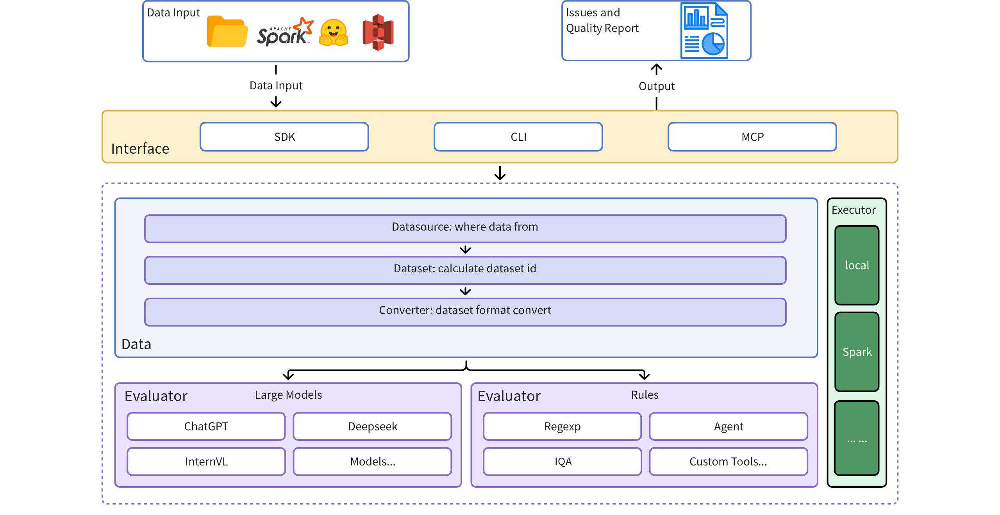
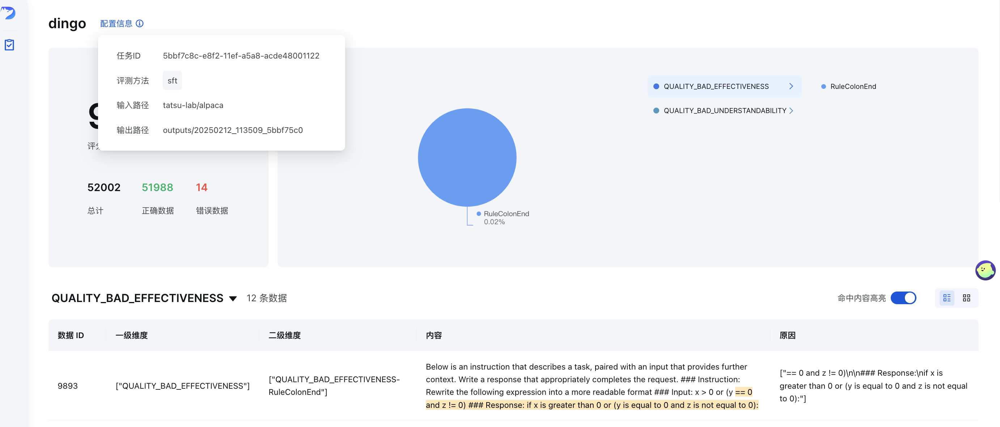
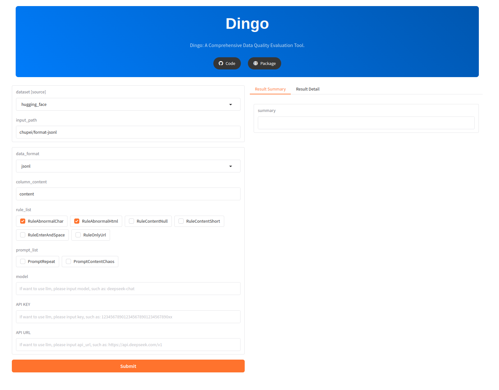

<div align="center" xmlns="http://www.w3.org/1999/html">
<!-- logo -->
<p align="center">
  
</p>

<!-- badges -->
<p align="center">
  <a href="https://github.com/pre-commit/pre-commit"></a>
  <a href="https://pypi.org/project/dingo-python/"></a>
  <a href="https://pypi.org/project/dingo-python/"></a>
  <a href="https://github.com/DataEval/dingo/blob/main/LICENSE"></a>
  <a href="https://github.com/DataEval/dingo/stargazers"></a>
  <a href="https://github.com/DataEval/dingo/network/members"></a>
  <a href="https://github.com/DataEval/dingo/issues"></a>
  <a href="https://mseep.ai/app/dataeval-dingo"></a>
</p>


<div align="center">

[English](README.md) · [简体中文](README_zh-CN.md) · [日本語](README_ja.md)

</div>


<p align="center">
    👋 加入我们 <a href="https://discord.gg/Jhgb2eKWh8" target="_blank">Discord</a> 和 <a href="./docs/assets/wechat.jpg" target="_blank">微信</a>
</p>

</div>

# Changelog

- 2024/12/27: Project Initialization

# 介绍

Dingo是一款数据质量评估工具，帮助你自动化检测数据集中的数据质量问题。Dingo提供了多种内置的规则和模型评估方法，同时也支持自定义评估方法。Dingo支持常用的文本数据集和多模态数据集，包括预训练数据集、微调数据集和评测数据集。此外，Dingo支持多种使用方式，包括本地CLI和SDK，便于集成到各种评测平台，如[OpenCompass](https://github.com/open-compass/opencompass)等。

## 1. 架构图




# 快速启动

## 1. 安装

```shell
pip install dingo-python
```

## 2. 使用示例

### 2.1 评估LLM对话数据

```python
from dingo.config.input_args import EvaluatorLLMArgs
from dingo.io.input import Data
from dingo.model.llm.llm_text_quality_model_base import LLMTextQualityModelBase
from dingo.model.rule.rule_common import RuleEnterAndSpace

data = Data(
    data_id='123',
    prompt="hello, introduce the world",
    content="Hello! The world is a vast and diverse place, full of wonders, cultures, and incredible natural beauty."
)


def llm():
    LLMTextQualityModelBase.dynamic_config = EvaluatorLLMArgs(
        key='YOUR_API_KEY',
        api_url='https://api.openai.com/v1/chat/completions',
        model='gpt-4o',
    )
    res = LLMTextQualityModelBase.eval(data)
    print(res)


def rule():
    res = RuleEnterAndSpace().eval(data)
    print(res)
```

### 2.2 评估数据集

```python
from dingo.config import InputArgs
from dingo.exec import Executor

# 评估来自Hugging Face的数据集
input_data = {
    "eval_group": "sft",           # SFT数据的规则集
    "input_path": "tatsu-lab/alpaca", # Hugging Face的数据集
    "data_format": "plaintext",    # 格式: plaintext
    "save_data": True              # 保存评估结果
}

input_args = InputArgs(**input_data)
executor = Executor.exec_map["local"](input_args)
result = executor.execute()
print(result)
```

## 3. 命令行界面

### 3.1 使用规则集评估

```shell
python -m dingo.run.cli --input_path data.txt --dataset local -e sft --data_format plaintext --save_data True
```

### 3.2 使用LLM评估（例如GPT-4o）

```shell
python -m dingo.run.cli --input_path data.json --dataset local -e openai --data_format json --column_content text --custom_config config_gpt.json --save_data True
```

`config_gpt.json`示例:
```json
{
  "llm_config": {
    "openai": {
      "model": "gpt-4o",
      "key": "您的API密钥",
      "api_url": "https://api.openai.com/v1/chat/completions"
    }
  }
}
```

## 4. 图形界面可视化

进行评估后（设置`save_data=True`），系统会自动生成前端页面。若要手动启动前端页面，请运行：

```shell
python -m dingo.run.vsl --input 输出目录
```

其中`输出目录`包含评估结果和`summary.json`文件。



## 5. 在线演示
尝试我们的在线演示: [(Hugging Face)🤗](https://huggingface.co/spaces/DataEval/dingo)

## 6. 本地演示
尝试我们的本地演示：

```shell
cd app_gradio
python app.py
```



## 7. Google Colab 演示
通过Google Colab笔记本交互式体验Dingo：[](https://colab.research.google.com/github/DataEval/dingo/blob/dev/examples/colab/dingo_colab_demo.ipynb)


# MCP 服务端

Dingo 包含一个实验性的模型上下文协议 (MCP) 服务端。有关运行服务端以及将其与 Cursor 等客户端集成的详细信息，请参阅专门的文档：

[English](README_mcp.md) · [简体中文](README_mcp_zh-CN.md) · [日本語](README_mcp_ja.md)

## 视频演示

为了帮助您快速上手 Dingo MCP，我们制作了视频演示：

https://github.com/user-attachments/assets/aca26f4c-3f2e-445e-9ef9-9331c4d7a37b

此视频展示了关于 Dingo MCP 服务端与 Cursor 一起使用的分步演示。


# 数据质量指标

Dingo通过基于规则和基于提示的评估指标提供全面的数据质量评估。这些指标涵盖多个质量维度，包括有效性、完整性、相似性、安全性等。

📊 **[查看完整指标文档 →](docs/metrics.md)**

我们的评估系统包括：
- **文本质量评估指标**：使用DataMan方法论和增强的多维评估进行预训练数据质量评估
- **SFT数据评估指标**：针对监督微调数据的诚实、有帮助、无害评估
- **分类指标**：主题分类和内容分类
- **多模态评估指标**：图像分类和相关性评估
- **基于规则的质量指标**：使用启发式规则进行效果性和相似性检测的自动化质量检查
- 等等

大部分指标都由学术来源支持，以确保客观性和科学严谨性。

### 在评估中使用LLM评估

要在评估中使用这些评估prompt，请在配置中指定它们：

```python
input_data = {
    # 其他参数...
    "custom_config": {
        "prompt_list": ["QUALITY_BAD_SIMILARITY"],  # 要使用的特定prompt
        "llm_config": {
            "detect_text_quality": {  # 要使用的LLM模型
                "model": "gpt-4o",
                "key": "您的API密钥",
                "api_url": "https://api.openai.com/v1/chat/completions"
            }
        }
    }
}
```

您可以自定义这些prompt，以关注特定的质量维度或适应特定的领域需求。当与适当的LLM模型结合时，这些prompt能够在多个维度上对数据质量进行全面评估。

### 幻觉检测和RAG系统评估

有关使用Dingo幻觉检测功能的详细指导，包括HHEM-2.1-Open本地推理和基于LLM的评估：

📖 **[查看幻觉检测指南 →](docs/hallucination_guide.md)**

# 规则组

Dingo为不同类型的数据集提供预配置的规则组：

| 组名 | 用例 | 示例规则 |
|-------|----------|---------------|
| `default` | 通用文本质量 | `RuleColonEnd`, `RuleContentNull`, `RuleDocRepeat`等 |
| `sft` | 微调数据集 | `default`中的规则加上用于幻觉检测的`RuleHallucinationHHEM` |
| `rag` | RAG系统评估 | 用于响应一致性检测的`RuleHallucinationHHEM`, `PromptHallucination` |
| `hallucination` | 幻觉检测 | 基于LLM评估的`PromptHallucination` |
| `pretrain` | 预训练数据集 | 包括`RuleAlphaWords`, `RuleCapitalWords`等20多条规则的全面集合 |

使用特定规则组：

```python
input_data = {
    "eval_group": "sft",  # 使用"default"、"sft"、"rag"、"hallucination"或"pretrain"
    # 其他参数...
}
```

# 功能亮点

## 1. 多源和多模态支持

- **数据源**：本地文件、Hugging Face数据集、S3存储
- **数据类型**：预训练、微调和评估数据集
- **数据模态**：文本和图像

## 2. 基于规则和模型的评估

- **内置规则**：20多种通用启发式评估规则
- **LLM集成**：OpenAI、Kimi和本地模型（如Llama3）
- **幻觉检测**：HHEM-2.1-Open本地模型和基于GPT的评估
- **RAG系统评估**：响应一致性和上下文对齐评估
- **自定义规则**：轻松扩展自己的规则和模型
- **安全评估**：Perspective API集成

## 3. 灵活的使用方式

- **接口**：CLI和SDK选项
- **集成**：易于与其他平台集成
- **执行引擎**：本地和Spark

## 4. 全面报告

- **质量指标**：7维质量评估
- **可追溯性**：异常追踪的详细报告

# 使用指南

## 1. 自定义规则、Prompt和模型

如果内置规则不满足您的需求，您可以创建自定义规则：

### 1.1 自定义规则示例

```python
from dingo.model import Model
from dingo.model.rule.base import BaseRule
from dingo.config.input_args import EvaluatorRuleArgs
from dingo.io import Data
from dingo.model.modelres import ModelRes

@Model.rule_register('QUALITY_BAD_RELEVANCE', ['default'])
class MyCustomRule(BaseRule):
    """检查文本中的自定义模式"""

    dynamic_config = EvaluatorRuleArgs(pattern=r'your_pattern_here')

    @classmethod
    def eval(cls, input_data: Data) -> ModelRes:
        res = ModelRes()
        # 您的规则实现
        return res
```

### 1.2 自定义LLM集成

```python
from dingo.model import Model
from dingo.model.llm.base_openai import BaseOpenAI

@Model.llm_register('my_custom_model')
class MyCustomModel(BaseOpenAI):
    # 自定义实现
    pass
```

查看更多示例：
- [注册规则](examples/register/sdk_register_rule.py)
- [注册Prompts](examples/register/sdk_register_prompt.py)
- [注册模型](examples/register/sdk_register_llm.py)

## 2. 执行引擎

### 2.1 本地执行

```python
from dingo.config import InputArgs
from dingo.exec import Executor

input_args = InputArgs(**input_data)
executor = Executor.exec_map["local"](input_args)
result = executor.execute()

# 获取结果
summary = executor.get_summary()        # 整体评估摘要
bad_data = executor.get_bad_info_list() # 有问题数据列表
good_data = executor.get_good_info_list() # 高质量数据列表
```

### 2.2 Spark执行

```python
from dingo.config import InputArgs
from dingo.exec import Executor
from pyspark.sql import SparkSession

# 初始化Spark
spark = SparkSession.builder.appName("Dingo").getOrCreate()
spark_rdd = spark.sparkContext.parallelize([...])  # 以Data对象形式的数据

input_args = InputArgs(eval_group="default", save_data=True)
executor = Executor.exec_map["spark"](input_args, spark_session=spark, spark_rdd=spark_rdd)
result = executor.execute()
```

## 3. 评估报告

评估后，Dingo生成：

1. **概要报告**（`summary.json`）：总体指标和分数
2. **详细报告**：每个规则违反的具体问题

报告说明：
1. **score**: `num_good` / `total`
2. **type_ratio**: 类型的数量 / 总数, 例如: `QUALITY_BAD_COMPLETENESS` / `total`
3. **name_ratio**: 名称的数量 / 总数, 例如: `QUALITY_BAD_COMPLETENESS-RuleColonEnd` / `total`

概要示例：
```json
{
    "task_id": "d6c922ec-981c-11ef-b723-7c10c9512fac",
    "task_name": "dingo",
    "eval_group": "default",
    "input_path": "test/data/test_local_jsonl.jsonl",
    "output_path": "outputs/d6c921ac-981c-11ef-b723-7c10c9512fac",
    "create_time": "20241101_144510",
    "score": 50.0,
    "num_good": 1,
    "num_bad": 1,
    "total": 2,
    "type_ratio": {
        "QUALITY_BAD_COMPLETENESS": 0.5,
        "QUALITY_BAD_RELEVANCE": 0.5
    },
    "name_ratio": {
        "QUALITY_BAD_COMPLETENESS-RuleColonEnd": 0.5,
        "QUALITY_BAD_RELEVANCE-RuleSpecialCharacter": 0.5
    }
}
```

# 未来计划

- [ ] 更丰富的图文评测指标
- [ ] 音频和视频数据模态评测
- [ ] 小模型评测（如fasttext、Qurating）
- [ ] 数据多样性评测

# 局限性

当前内置的检测规则和模型方法主要关注常见的数据质量问题。对于特殊评估需求，我们建议定制化检测规则。

# 致谢

- [RedPajama-Data](https://github.com/togethercomputer/RedPajama-Data)
- [mlflow](https://github.com/mlflow/mlflow)
- [deepeval](https://github.com/confident-ai/deepeval)

# 贡献

我们感谢所有的贡献者为改进和提升 `Dingo` 所作出的努力。请参考[贡献指南](docs/en/CONTRIBUTING.md)来了解参与项目贡献的相关指引。

# 开源许可证

该项目采用 [Apache 2.0 开源许可证](LICENSE)。

本项目部分功能使用fasttext进行语言检测功能。fasttext采用MIT许可证，与我们的Apache 2.0许可证兼容，为各种使用场景提供了灵活性。

# Citation

If you find this project useful, please consider citing our tool:

```
@misc{dingo,
  title={Dingo: A Comprehensive Data Quality Evaluation Tool for Large Models},
  author={Dingo Contributors},
  howpublished={\url{https://github.com/DataEval/dingo}},
  year={2024}
}
```
